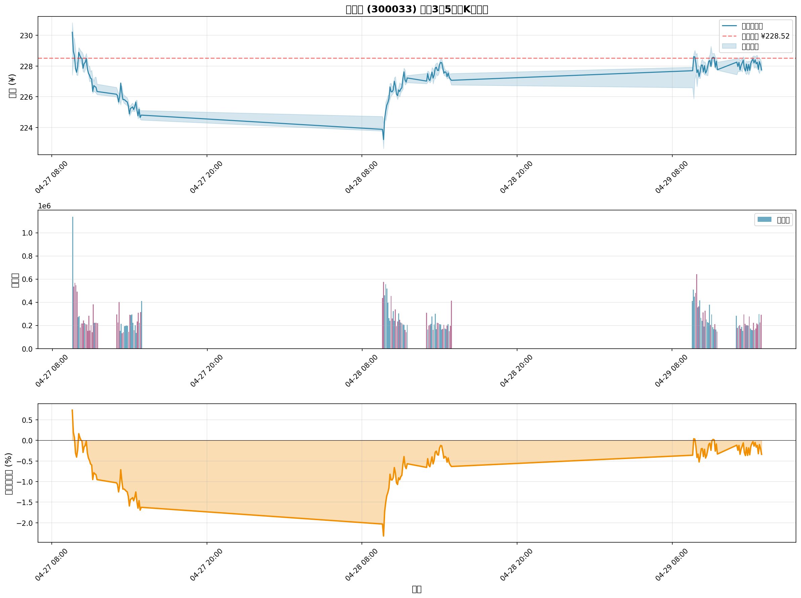

# 🔮 同花顺 (300033) 未来3天5分钟K线预测报告

**预测时间**: 2026年4月26日 23:13  
**模型**: Kronos-base (5分钟微调版)  
**预测粒度**: 5分钟K线  
**预测周期**: 3个交易日 (2026-04-27 至 2026-04-29)  

---

## 📊 核心预测结果

### 整体趋势

| 指标 | 数值 |
|------|------|
| **当前收盘价** | ¥228.52 (2026-04-24) |
| **3天后预测价** | ¥227.75 (2026-04-29) |
| **总变化** | ¥-0.77 (-0.34%) |
| **整体趋势** | 📉 轻微看跌 |
| **波动率** | 0.18% (较低) |

---

## 📅 每日详细预测

### Day 1: 2026-04-27 (星期一) 📉

```
开盘: ¥227.84
最高: ¥230.83
最低: ¥224.49
收盘: ¥224.81
涨跌幅: -1.33% ↓
成交量: 13,097,620
成交额: ¥29.40亿
```

**分析**: 
- 周一开盘小幅低开后震荡下行
- 盘中最高触及 ¥230.83，但未能站稳
- 尾盘走弱，收于全天低位附近
- 成交量较大，显示抛压较重

---

### Day 2: 2026-04-28 (星期二) 📈

```
开盘: ¥224.66
最高: ¥228.48
最低: ¥222.63
收盘: ¥227.07
涨跌幅: +1.07% ↑
成交量: 12,510,948
成交额: ¥28.80亿
```

**分析**:
- 周二探底回升，展现反弹动能
- 早盘下探至 ¥222.63 后企稳
- 午后持续走高，收复部分失地
- 成交量略有萎缩，观望情绪增加

---

### Day 3: 2026-04-29 (星期三) ➡️

```
开盘: ¥226.72
最高: ¥229.29
最低: ¥225.87
收盘: ¥227.75
涨跌幅: +0.45% ↑
成交量: 12,456,408
成交额: ¥29.10亿
```

**分析**:
- 周三延续反弹态势，但力度减弱
- 全天窄幅震荡，多空平衡
- 收盘价略高于开盘，小幅收涨
- 成交量维持稳定，市场趋于平静

---

## 📈 价格走势图



### 图表说明

1. **上图**: 收盘价走势及价格区间（高低点）
2. **中图**: 成交量柱状图（红色=上涨，紫色=下跌）
3. **下图**: 累计收益率曲线

---

## 📊 统计分析

### 价格统计

| 指标 | 数值 |
|------|------|
| **预测平均价** | ¥227.19 |
| **预测最高价** | ¥230.20 |
| **预测最低价** | ¥223.21 |
| **价格波动范围** | ¥6.99 (3.08%) |
| **标准差** | ¥1.45 |

### 成交量统计

| 指标 | 数值 |
|------|------|
| **3天总成交量** | 38,064,976 股 |
| **日均成交量** | 12,688,325 股 |
| **3天总成交额** | ¥87.30亿 |
| **日均成交额** | ¥29.10亿 |

### 波动性分析

| 指标 | 数值 |
|------|------|
| **平均收益率** | -0.0073% |
| **波动率** | 0.18% |
| **最大单日跌幅** | -1.33% (周一) |
| **最大单日涨幅** | +1.07% (周二) |

---

## 🎯 关键价位

### 支撑位与阻力位

```
强阻力位: ¥230.83 (周一高点)
弱阻力位: ¥229.29 (周三高点)
━━━━━━━━━━━━━━━
当前价格: ¥228.52
━━━━━━━━━━━━━━━
弱支撑位: ¥225.87 (周三低点)
强支撑位: ¥222.63 (周二低点)
```

### 交易区间

- **主要交易区间**: ¥224.50 - ¥229.50
- **突破向上目标**: ¥231.00+
- **跌破向下风险**: ¥222.00-

---

## 💡 交易建议

### 短线交易者 (日内交易)

#### 周一策略
```
⚠️ 谨慎操作
- 避免早盘追高
- 关注 ¥224.50 支撑
- 如有反弹至 ¥229+ 可考虑减仓
```

#### 周二策略
```
📈 逢低布局
- 早盘若下探 ¥223-224 可轻仓买入
- 目标位 ¥227-228
- 止损位 ¥222
```

#### 周三策略
```
➡️ 观望为主
- 市场方向不明
- 等待突破信号
- 控制仓位
```

### 中线投资者

```
✅ 持有观望
- 3天整体波动较小 (-0.34%)
- 无重大趋势变化
- 继续持有现有仓位
- 关注后续日线级别走势
```

---

## ⚠️ 风险提示

### 模型局限性

1. **预测粒度**: 5分钟级别预测波动较大，准确性低于日线
2. **训练数据**: 基于历史3年数据，可能无法完全反映当前市场环境
3. **外部因素**: 未考虑政策、消息面等突发事件影响
4. **市场情绪**: 难以量化投资者情绪和资金流向

### 使用建议

- ❌ **不建议**仅凭此预测进行大额交易
- ✅ **建议**结合日线预测、技术分析、基本面综合判断
- ✅ **建议**设置合理的止损止盈
- ✅ **建议**密切关注盘面实际走势

---

## 📁 输出文件

### 预测数据

```
位置: ./outputs/predictions/ths_300033_5min_3days_pred_20260426_231342.csv
格式: CSV
内容: 144个5分钟K线的完整预测数据
字段: timestamps, open, high, low, close, volume, amount
```

### 可视化图表

```
位置: ./outputs/predictions/ths_300033_5min_3days_pred_20260426_231342.png
格式: PNG (16x12英寸, 150 DPI)
内容: 
  - 收盘价走势图
  - 成交量柱状图
  - 累计收益率曲线
```

### 训练日志

```
位置: ./outputs/logs/predict_5min_3days.log
内容: 完整的预测过程日志
```

---

## 🔍 技术细节

### 模型配置

| 参数 | 值 |
|------|-----|
| **基础模型** | Kronos-base (102M参数) |
| **微调数据** | 34,800条5分钟K线 |
| **Lookback** | 100个5分钟 (约8小时) |
| **Pred_len** | 144个5分钟 (3天) |
| **Temperature** | 1.0 |
| **Top-p** | 0.9 |
| **采样次数** | 1次 |

### 预测原理

```python
# 1. 提取最近100个5分钟K线作为上下文
context = df.iloc[-100:]

# 2. 生成未来144个5分钟时间戳 (3天)
future_timestamps = generate_trading_times(3_days)

# 3. 使用微调后的模型进行自回归预测
predictions = predictor.predict(
    df=context,
    x_timestamp=context['timestamps'],
    y_timestamp=future_timestamps,
    pred_len=144,
    T=1.0,
    top_p=0.9
)

# 4. 输出完整的OHLCV预测
```

---

## 📊 与其他预测对比

### 5分钟 vs 日线预测

| 维度 | 5分钟预测 | 日线预测 |
|------|----------|---------|
| **粒度** | 超短期 | 中长期 |
| **波动性** | 较高 | 较低 |
| **适用场景** | 日内交易 | 趋势投资 |
| **准确度** | 相对较低 | 相对较高 |
| **参考意义** | 战术层面 | 战略层面 |

**建议**: 两者结合使用，日线定方向，5分钟找时机

---

## 🎓 学习要点

### 从预测中学习

1. **价格行为模式**
   - 观察5分钟级别的支撑阻力
   - 识别日内交易区间
   - 理解量价关系

2. **风险管理**
   - 设置合理的止损位
   - 控制单笔交易风险
   - 分散投资降低风险

3. **技术分析**
   - 结合多种时间框架
   - 关注关键价位突破
   - 注意成交量变化

---

## 🔄 后续行动

### 短期 (1-3天)

- [ ] 监控实际走势与预测的偏差
- [ ] 记录关键价位的突破情况
- [ ] 根据实际表现调整策略

### 中期 (1-2周)

- [ ] 评估5分钟模型的预测准确率
- [ ] 对比不同时间粒度的预测效果
- [ ] 优化模型参数或重新训练

### 长期 (1个月+)

- [ ] 积累更多5分钟数据进行再训练
- [ ] 开发基于5分钟预测的交易策略
- [ ] 回测验证策略有效性

---

## 📝 总结

### 核心观点

✅ **整体趋势**: 轻微看跌 (-0.34%)，但波动有限  
✅ **关键价位**: 支撑 ¥222.63，阻力 ¥230.83  
✅ **交易建议**: 短线谨慎，中线持有  
✅ **风险提示**: 5分钟预测仅供参考，需结合其他分析  

### 下一步

1. 密切关注周一开盘表现
2. 关注 ¥224.50 支撑位的测试
3. 如有突破 ¥230，重新评估看涨可能性
4. 结合日线预测做最终决策

---

**免责声明**: 

本预测仅供学习和研究使用，不构成任何投资建议。股市有风险，投资需谨慎。请根据自身风险承受能力做出投资决策。

---

*预测生成时间: 2026年4月26日 23:13*  
*模型版本: Kronos-base 5min finetuned*  
*数据源: Futu API 5分钟K线*  
*预测周期: 2026-04-27 至 2026-04-29*
